# 基础概念
Linux Bridge（网桥）是用纯软件实现的虚拟交换机，有着和物理交换机相同的功能，例如二层交换，MAC地址学习等。因此我们可以把tun/tap，veth pair等设备绑定到网桥上，就像是把设备连接到物理交换机上一样。此外它和veth pair、tun/tap一样，也是一种虚拟网络设备，具有虚拟设备的所有特性，例如配置IP，MAC地址等。
Linux Bridge通常是搭配KVM、docker等虚拟化技术一起使用的，用于构建虚拟网络。对于普通的网络设备来说，只有两端，从一端进来的数据会从另一端出去，如物理网卡从外面网络中收到的数据会转发给内核协议栈，而从协议栈过来的数据会转发到外面的物理网络中。而bridge不同，bridge有多个端口，数据可以从任何端口进来，进来之后从哪个口出去和物理交换机的原理差不多，要看mac地址。

# 使用方法
## 创建bridge
用iproute2创建一个bridge
```
sudo ip link add name br0 type bridge
sudo ip link set br0 up
```
或者使用这个工具创建bridge
```
brctl addbr br0                     # 添加名为 br0 的网桥
```
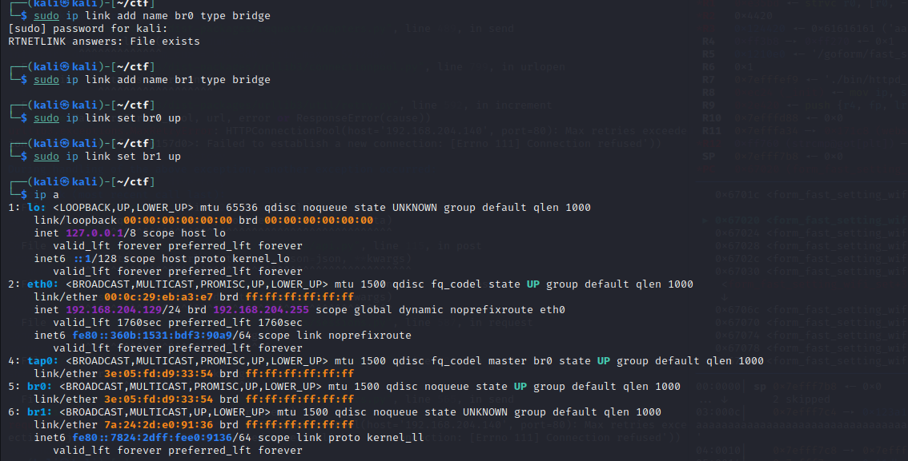
此时这个网桥只有一个端口连着协议栈，这样的网桥没有任何实际的功能，如下图所示

创建一对veth设备（关于veth设备的解释，见该目录下 veth设备.md），并配置上ip
```
sudo ip link add veth0 type veth peer name veth1 # 创建一对虚拟以太网设备(veth)，这对设备被称为虚拟以太网对(veth pair)，其中一个设备被命名为veth0，另一个设备被命名为veth1
sudo ip addr add 192.168.204.200/24 dev veth0
sudo ip addr add 192.168.204.201/24 dev veth1
# 为这对veth设置ip地址
sudo ip link set veth0 up
sudo ip link set veth1 up
# 启动设备
```
将veth0连上br0
```
sudo ip link set dev veth0 master br0
# 通过bridge link命令可以看到br0上连接了哪些设备
```
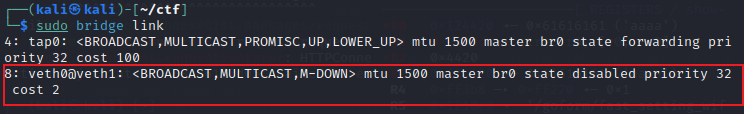
(tap0是之前的实验，实际上bridge有多个端口，可以连接多个设备)
这时，网络就变成了这个样子

将br0和veth0相连之后，发生了几个变化：
1、br0和veth0之间连接起来了，并且是双向的数据通道
2、协议栈和veth0之间变成了单通道，协议栈能发数据给veth0，但veth0从外面收到的数据不会转发给协议栈
3、br0的mac地址变成了veth0的mac地址
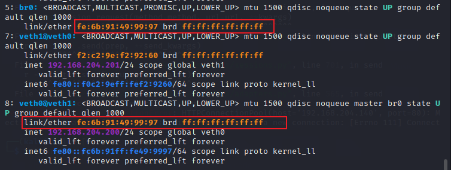
相当于br0设备在veth0和协议栈之间插了一脚，将veth0要发给协议栈的数据被br0拦截了，全部转发给了bridge，同时bridge也可以向veth0发送数据。
做一个实验，用veth0去ping veth1

为什么ping不通呢？抓包看一下

再看一下veth0
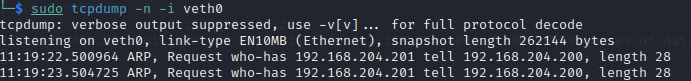
在IPv4网络中，主机之间通信使用IP地址来标识，而在以太网（Ethernet）这样的局域网中，通信则使用MAC地址来识别设备。当主机A要与主机B通信时，如果A知道B的IP地址，但不知道B的MAC地址，那么A就需要通过ARP（Address Resolution Protocol）来获取B的MAC地址。所以在ping之前，会先发送arp请求来获取mac地址。
根据博主的文章，他用veth0去ping veth1，veth0成功发送了arp请求包，而veth1也成功接收了arp请求包，并且进行返回，但是根据我抓的包来看，veth1并没有进行返回。
通过博主评论区中的回答，以这种方式进行解决：
```
echo 1 > /proc/sys/net/ipv4/conf/veth1/accept_local
echo 1 > /proc/sys/net/ipv4/conf/veth0/accept_local
echo 0 > /proc/sys/net/ipv4/conf/all/rp_filter
echo 0 > /proc/sys/net/ipv4/conf/veth0/rp_filter
echo 0 > /proc/sys/net/ipv4/conf/veth1/rp_filter
# accept_local这个文件控制了是否接受本地生成的数据包，当该值为1时，表示允许接受本地生成的数据包
# accept_local这个文件控制了反向路径过滤（Reverse Path Filtering，RP Filtering），当RP过滤开启时（设置为1），内核会检查数据包的入站路径是否与出站路径相匹配（内核通过路由表、ARP解析、防火墙规则等机制来检查和决定数据包的出站路径和入站路径），如果不匹配，则可能会丢弃该数据包。将其设置为0会禁用RP过滤
```
重新进行试验


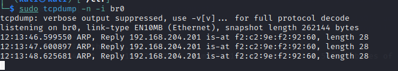
从抓的包来看，veth0尝试获取veth1的mac地址，并且veth1成功接受到了，并且进行回包。但是问题来源于veth0收到应答包之后没有给协议栈，而是给了br0，于是协议栈得不到veth1的mac地址，从而通信失败
## 给bridge配上ip
从上文得知，给veth0配ip地址没有意义，因为就算协议栈传数据给veth0，应答包也回不来。这里我们就将veth0的ip让给bridge。
```
sudo ip addr del 192.168.204.200/24 dev veth0
sudo ip addr add 192.168.204.200/24 dev br0
```
于是网络结构就变成了这样

其实veth0和协议栈之间还是有联系的，但由于veth0没有配置IP，所以协议栈在路由的时候不会将数据包发给veth0，就算强制要求数据包通过veth0发送出去，但由于veth0从另一端收到的数据包只会给br0，所以协议栈还是没法收到相应的arp应答包，导致通信失败。
这里为了表达更直观，将协议栈和veth0之间的联系去掉了，veth0相当于一根网线。
再通过br0 ping 一下 veth1，成功

但是ping网关失败了，因为这个bridge上只有两个网络设备，分别是veth0和veth1，br0不知道网关在哪
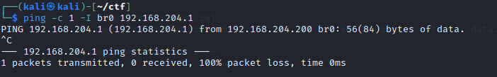
## 将物理网卡添加到bridge
把eth0添加到br0上：
```
sudo ip link set dev eth0 master br0
sudo bridge link
```
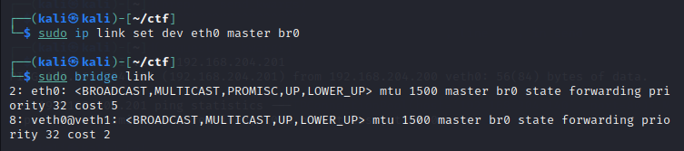
此时，网络结构如下
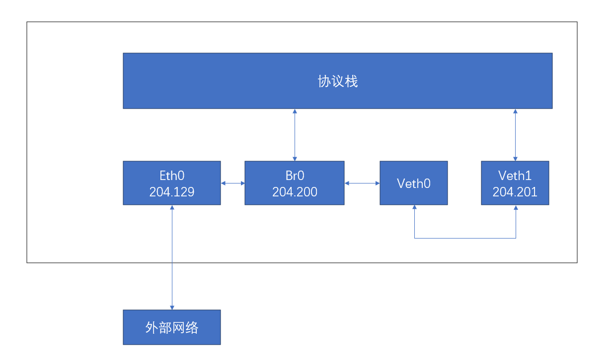
eth0会将外部所有的数据都转发给br0
而且eth0没有办法ping通网关，而br0可以ping通网关；veth0无法ping通网关，veth1可以ping通网关
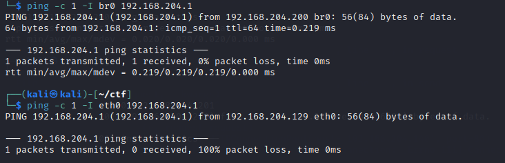
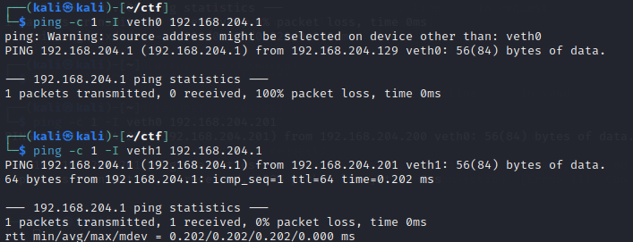
由于eth0已经变成了和网线差不多的功能，所以在eth0上配置IP已经没有什么意义了，并且还会影响协议栈的路由选择，比如如果上面ping的时候不指定网卡的话，协议栈有可能优先选择eth0，导致ping不通，所以这里需要将eth0上的IP去掉。
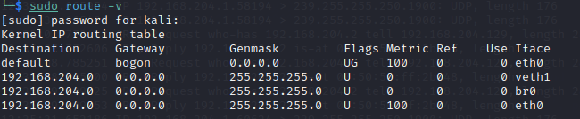
```
sudo route -v # 查看路由表
sudo ip addr del 192.168.204.129/24 dev eth0 # 去掉eth0上的ip地址
```

这是因为去掉ip地址之后，路由表里就没有eth0这这一项了，于是数据包就会从veth1出去
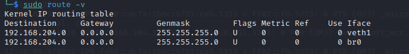
经过上述操作之后，网络就变成了这样

## bridge必须要配置ip地址吗
在我们常见的物理交换机中，有可以配置IP和不能配置IP两种，不能配置IP的交换机一般通过com口连上去做配置（更简单的交换机连com口的没有，不支持任何配置），而能配置IP的交换机可以在配置好IP之后，通过该IP远程连接上去做配置，从而更方便。

bridge就属于后一种交换机，自带虚拟网卡，可以配置IP，该虚拟网卡一端连在bridge上，另一端跟协议栈相连。和物理交换机一样，bridge的工作不依赖于该虚拟网卡，但bridge工作不代表机器能连上网，要看组网方式。
删除br0上的ip：
```
sudo ip addr del 192.168.204.200/24 dev br0
```
于是网络就变成了，相当于br0的一个端口通过eth0连着交换机，另一个端口通过veth0连着veth1

ping网关成功

## bridge常用场景
### 虚拟机
虚拟机通过tun/tap或者其它类似的虚拟网络设备，将虚拟机内的网卡同br0连接起来，这样就达到和真实交换机一样的效果，虚拟机发出去的数据包先到达br0，然后由br0交给eth0发送出去，数据包都不需要经过host机器的协议栈，效率高。
比如在CVE2018-16333当中使用qemu进行模拟时，网络是这样的

### docker
docker使用bridge进行网络配置的案例我还没有进行试验。
根据博主的描述，由于容器运行在自己单独的network namespace里面，所以都有自己单独的协议栈，情况和上面的虚拟机差不多，但它采用了另一种方式来和外界通信：
```
+----------------------------------------------------------------+-----------------------------------------+-----------------------------------------+
|                          Host                                  |              Container 1                |              Container 2                |
|                                                                |                                         |                                         |
|       +------------------------------------------------+       |       +-------------------------+       |       +-------------------------+       |
|       |             Newwork Protocol Stack             |       |       |  Newwork Protocol Stack |       |       |  Newwork Protocol Stack |       |
|       +------------------------------------------------+       |       +-------------------------+       |       +-------------------------+       |
|            ↑             ↑                                     |                   ↑                     |                    ↑                    |
|............|.............|.....................................|...................|.....................|....................|....................|
|            ↓             ↓                                     |                   ↓                     |                    ↓                    |
|        +------+     +--------+                                 |               +-------+                 |                +-------+                |
|        |.3.101|     |  .9.1  |                                 |               |  .9.2 |                 |                |  .9.3 |                |
|        +------+     +--------+     +-------+                   |               +-------+                 |                +-------+                |
|        | eth0 |     |   br0  |<--->|  veth |                   |               | eth0  |                 |                | eth0  |                |
|        +------+     +--------+     +-------+                   |               +-------+                 |                +-------+                |
|            ↑             ↑             ↑                       |                   ↑                     |                    ↑                    |
|            |             |             +-------------------------------------------+                     |                    |                    |
|            |             ↓                                     |                                         |                    |                    |
|            |         +-------+                                 |                                         |                    |                    |
|            |         |  veth |                                 |                                         |                    |                    |
|            |         +-------+                                 |                                         |                    |                    |
|            |             ↑                                     |                                         |                    |                    |
|            |             +-------------------------------------------------------------------------------|--------------------+                    |
|            |                                                   |                                         |                                         |
|            |                                                   |                                         |                                         |
|            |                                                   |                                         |                                         |
+------------|---------------------------------------------------+-----------------------------------------+-----------------------------------------+
             ↓
     Physical Network  (192.168.3.0/24)
```
容器中配置网关为.9.1，发出去的数据包先到达br0，然后交给host机器的协议栈，由于目的IP是外网IP，且host机器开启了IP forward功能，于是数据包会通过eth0发送出去，由于.9.1是内网IP，所以一般发出去之前会先做NAT转换（NAT转换和IP forward功能都需要自己配置）。由于要经过host机器的协议栈，并且还要做NAT转换，所以性能没有上面虚拟机那种方案好，优点是容器处于内网中，安全性相对要高点。（由于数据包统一由IP层从eth0转发出去，所以不存在mac地址的问题，在无线网络环境下也工作良好）

# 参考文章
https://segmentfault.com/a/1190000009491002
https://zhuanlan.zhihu.com/p/293667316
https://wzt.ac.cn/2021/05/28/QEMU-networking/
# bridge相关命令
1、创建bridge
```
sudo ip link add name [bridge_name] type bridge
sudo ip link set [bridge_name] up
```
或者用这种方式
```
apt-get install bridge-utils        # 虚拟网桥工具
apt-get install uml-utilities       # UML（User-mode linux）工具
brctl addbr [bridge_name] 
ifconfig [bridge_name] 0.0.0.0 promisc up 
```
2、删除birdge
```
sudo ip link add name [bridge_name] type bridge
```
或者
```
sudo brctl delbr [bridge_name]
```
3、将某网络设备连接/断开bridge
```
sudo ip link set dev [dev_name] master [bridge_name] # 连接
sudo ip link set dev [dev_name] down # 断开
```
或者
```
brctl addif [bridge_name] [dev_name] # 连接 
sudo brctl delif [bridge_name] [dev_name] # 断开
```
4、查看brideg上连接了哪些设备
```
sudo bridge link
```
5、为某设备删除/添加p地址
```
sudo ip addr del [ip_addr/num] dev [dev_name] # 删除
sudo ip addr add [ip_addr/num] dev [dev_name] # 添加
```
