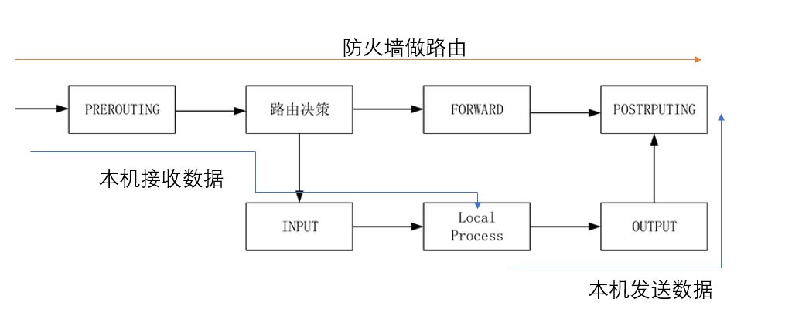
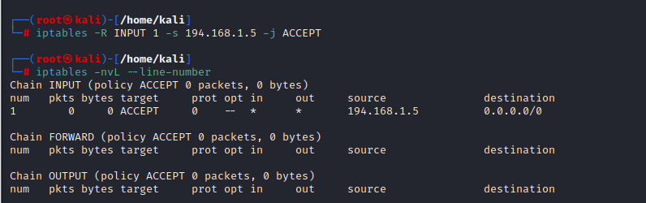
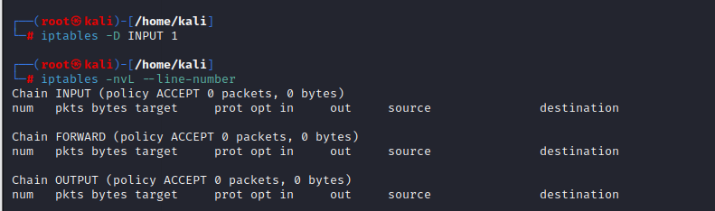

# 概述
iptables 是集成在 Linux 内核中的包过滤防火墙系统。使用 iptables 可以添加、删除具体的过滤规则，iptables 默认维护着 **4 个表和 5 个链**，所有的防火墙策略规则都被分别写入这些表与链中。
## 四表
“四表”是指 iptables 的功能，默认的 iptable s规则表有 filter 表（过滤规则表）、nat 表（地址转换规则表）、mangle（修改数据标记位规则表）、raw（跟踪数据表规则表）：
1、filter 表：控制数据包是否允许进出及转发，可以控制的链路有 INPUT、FORWARD 和 OUTPUT。
2、nat 表：控制数据包中地址转换，可以控制的链路有 PREROUTING、INPUT、OUTPUT 和 POSTROUTING。
3、mangle：修改数据包中的原数据，可以控制的链路有 PREROUTING、INPUT、OUTPUT、FORWARD 和 POSTROUTING。
4、raw：控制 nat 表中连接追踪机制的启用状况，可以控制的链路有 PREROUTING、OUTPUT。
## 五链
“五链”是指内核中控制网络的 NetFilter 定义的 5 个规则链。每个规则表中包含多个数据链：INPUT（入站数据过滤）、OUTPUT（出站数据过滤）、FORWARD（转发数据过滤）、PREROUTING（路由前过滤）和POSTROUTING（路由后过滤），防火墙规则需要写入到这些具体的数据链中。
## 过滤框架
下图是linux防火墙的过滤框架：


如果是外部主机发送数据包给防火墙本机，数据将会经过 PREROUTING 链与 INPUT 链；如果是防火墙本机发送数据包到外部主机，数据将会经过 OUTPUT 链与 POSTROUTING 链；如果防火墙作为路由负责转发数据，则数据将经过 PREROUTING 链、FORWARD 链以及 POSTROUTING 链。数据路径如下图所示：



# 语法格式
iptable命令的语法格式如下：
```
iptables [-t table] COMMAND [chain] CRETIRIA -j ACTION
-t：指定需要维护的防火墙规则表 filter、nat、mangle或raw。在不使用 -t 时则默认使用 filter 表。
COMMAND：子命令，定义对规则的管理。
chain：指明链表。
CRETIRIA：匹配参数。
ACTION：触发动作。
```
iptables 命令常用的选项及各自的功能如下：
```
-A	添加防火墙规则
-D	删除防火墙规则
-I	插入防火墙规则
-F	清空防火墙规则
-L	列出添加防火墙规则
-R	替换防火墙规则
-Z	清空防火墙数据表统计信息
-P	设置链默认规则
```
iptables 命令常用匹配参数及各自的功能如下：
```
-p	匹配协议，! 表示取反
-s	匹配源地址
-d	匹配目标地址
-i	匹配入站网卡接口
-o	匹配出站网卡接口
--sport	匹配源端口
--dport	匹配目标端口
--src-range	匹配源地址范围
--dst-range	匹配目标地址范围
--limit	匹配数据表速率
--limit-burst 与 --limit 一起使用，指定允许的最大突发匹配次数
--mac-source	匹配源MAC地址
--sports	匹配源端口
--dports	匹配目标端口
--stste	匹配状态（INVALID、ESTABLISHED、NEW、RELATED)
--string	匹配应用层字串
-m 或 --match 用于选择额外的匹配扩展模块，如 --match tcp 可用于匹配 TCP 数据包
--state 指定连接状态，如 --state ESTABLISHED,RELATED 可用于匹配已建立的连接及相关的数据包
--icmp-type 指定 ICMP 类型，用于匹配 ICMP 数据包的类型
-j 或 --jump 指定要执行的动作，如 ACCEPT、DROP、LOG 等
```
iptables 命令触发动作及各自的功能如下：
```
ACCEPT	允许数据包通过
DROP	丢弃数据包
REJECT	拒绝数据包通过
LOG	将数据包信息记录 syslog 曰志
DNAT	目标地址转换
SNAT	源地址转换
MASQUERADE	地址欺骗
REDIRECT	重定向
```
使用 -A 选项添加防火墙规则会将该规则追加到整个链的最后，而使用 -I 选项添加的防火墙规则则会默认插入到链中作为第一条规则。
内核会按照顺序依次检查 iptables 防火墙规则，如果数据包不符合条件，将会检查链中的下一条规则；如果符合条件，那么下一条规则由目标的值来指定，目标可以是用户定义的链的名称，也可以是 iptables-extensions（iptables-extensions 是指 iptables 工具的扩展模块，用于提供额外的功能和匹配条件） 中描述的目标之一，或者是特殊的值ACCEPT、DROP或RETURN。
ACCEPT意味着允许数据包通过。DROP意味着丢弃数据包。而匹配到了RETURN目标的规则时，会执行以下这些步骤：
1、停止当前链的遍历：数据包的处理将立即停止在当前链中。这意味着不会继续检查当前链中的其他规则，也不会执行后续的规则。
2、返回到调用链：数据包将返回到调用当前链的上一级链（调用链），继续执行上一级链中的下一条规则。这类似于函数调用中的返回操作。
# 实际使用
1、查看规则
```
iptables -nvL
-L 表示查看当前表的所有规则，默认查看的是 filter 表，如果要查看 nat 表，可以加上 -t nat 参数。
-n 表示不对 IP 地址进行反查，加上这个参数显示速度将会加快。
-v 表示输出详细信息，包含通过该规则的数据包数量、总字节数以及相应的网络接口。
```


2、添加规则
```
iptables -A INPUT -s 192.168.1.5 -j DROP
-A INPUT：-A 表示 "Append"，即在指定链（这里是 INPUT）的末尾添加一条规则。
-s 192.168.1.5：-s 表示 "source"，即源地址。这条规则会匹配源 IP 地址为 192.168.1.5 的数据包。
-j DROP：-j 表示 "jump"，用于指定要执行的动作。在这里，DROP 表示丢弃（阻止）与上述条件匹配的数据包。
这个命令的含义是：将一个规则添加到 INPUT 链，如果数据包的源地址是 192.168.1.5，则将其丢弃.
```


3、修改规则
```
-R INPUT 1：-R 表示 "replace"，用于替换指定链中的规则。INPUT 是链的名称，表示要替换 INPUT 链中的规则。1 是规则的序号，表示要替换第 1 条规则。
-s 194.168.1.5：-s 表示 "source"，即源地址。这个规则会匹配源 IP 地址为 194.168.1.5 的数据包。
-j ACCEPT：-j 表示 "jump"，用于指定要执行的动作。在这里，ACCEPT 表示接受（允许）与上述条件匹配的数据包。
这个命令的含义是：将名为 INPUT 的防火墙链中第 1 条规则替换为一个新的规则，如果数据包的源地址是 194.168.1.5，则接受这个数据包。
```



4、删除规则
```
iptables -D INPUT 1 -s 194.168.1.5 -j ACCEPT
或
iptables -D INPUT 1
这个命令的含义是：删除INPUT链的第1条规则
```



# 防火墙备份与还原
默认的 iptables 防火墙规则会立刻生效，但如果不保存，当计算机重启后所有的规则都会丢失，所以对防火墙规则进行及时保存的操作是非常必要的。
## 备份
iptables-save 命令用来批量导出 Linux 防火墙规则，语法介绍如下：
保存在默认文件夹中（保存防火墙规则）：
```
iptables-save > /etc/sysconfig/iptables
```
保存在其他位置（备份防火墙规则）：
```
iptables-save > [file_name]
```
直接执行 iptables-save 命令：
显示出当前启用的所有规则，按照 raw、mangle、nat、filter 表的顺序依次列出，如下所示：
```
iptables-save
“#”号开头的表示注释；
“*filter”表示所在的表；
“：链名默认策略”表示相应的链及默认策略，具体的规则部分省略了命令名“iptables”；
在末尾处“COMMIT”表示提交前面的规则设置。
```


列出某个表的规则内容：
```
iptables-save -t nat
-t [表名] : 表示列出某一个表。
```
## 还原
iptables-restore命令可以批量导入Linux防火墙规则，同时也需要结合重定向输入来指定备份文件的位置。
```
iptables-restore < [file_name]
```
# 参考文章
https://blog.csdn.net/daocaokafei/article/details/115091313
# 附录
[iptables.txt](../_resources/iptables-1.txt)
[iptables-save.txt](../_resources/iptables-save-1.txt)
[iptables-restore.txt](../_resources/iptables-restore-1.txt)
[iptables-extensions.txt](../_resources/iptables-extensions-1.txt)

