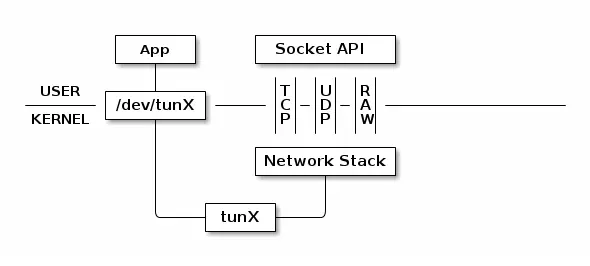

# TUN和TAP是什么
TUN设备是一种虚拟网络设备，通过此设备，程序可以方便地进行模拟网络行为。TUN模拟的是一个三层设备，可以通过它处理来自网络层的数据，也就是可以处理IP数据包。
首先看一下物理设备是如何工作的：


图中的eth0就是真实的网卡接口，网卡通过网线（wire）和外部网络进行连接，收到的数据包经过eth0传送给了内核协议栈（Network Stack），然后协议栈对数据包进行进一步的处理。
对于一些错误的数据包，协议栈会丢弃；不属于本机的数据包，协议栈会选择转发；而对于属于本机的数据包，并且该数据包会被上层的应用所需要，协议栈会通过Socket API告知上层正在等待的应用程序。
接下来看一下TUN的工作方式：



普通的网卡是通过网线来收发数据包，而TUN设备是通过文件来手法数据包。
在上图中tunX和eth0是等价的，tunX代表了一个网络接口，也就是这个系统通过软件模拟出来的。
网卡接口 tunX 所代表的虚拟网卡通过文件 /dev/tunX 与我们的应用程序(App) 相连，应用程序每次使用 write 之类的系统调用将数据写入该文件，这些数据会以网络层数据包的形式，通过该虚拟网卡，经由网络接口 tunX 传递给网络协议栈，同时该应用程序也可以通过 read 之类的系统调用，经由文件 /dev/tunX 读取到协议栈向 tunX 传递的所有数据包。
此外，协议栈可以像操纵普通网卡一样来操纵 tunX 所代表的虚拟网卡。比如说，给 tunX 设定 IP 地址，设置路由，总之，在协议栈看来，tunX 所代表的网卡和其他普通的网卡区别不大，只是tunX没有MAC地址，因为tunX只模拟到了网络层。而tapX对于协议栈来说和真实的网卡没有任何区别。
# TUN和TAP的区别
TAP 设备与 TUN 设备工作方式完全相同，区别在于：
1、TUN 设备是一个三层设备，它只模拟到了 IP 层，即网络层 我们可以通过 /dev/tunX 文件收发 IP 层数据包，它无法与物理网卡做 bridge，但是可以通过三层交换（如 ip_forward）与物理网卡连通。可以使用ifconfig之类的命令给该设备设定 IP 地址。
2、TAP 设备是一个二层设备，它比 TUN 更加深入，通过 /dev/tapX 文件可以收发 MAC 层数据包，即数据链路层，拥有 MAC 层功能，可以与物理网卡做 bridge，支持 MAC 层广播。同样的，我们也可以通过ifconfig之类的命令给该设备设定 IP 地址，你如果愿意，我们可以给它设定 MAC 地址。
# 操作
以qemu为例，一般使用这种虚拟设备和虚拟网桥让虚拟机可以连接外网
1、安装如下软件
```
apt-get install bridge-utils        # 虚拟网桥工具
apt-get install uml-utilities       # UML（User-mode linux）工具
```
2、添加网桥（需要root权限）
```
ifconfig <你的网卡名称(能上网的那张)> down    # 首先关闭宿主机网卡接口
brctl addbr br0                     # 添加名为 br0 的网桥
brctl addif br0 <你的网卡名称>        # 在 br0 中添加一个接口
brctl stp br0 off                   # 如果只有一个网桥，则关闭生成树协议
brctl setfd br0 1                   # 设置 br0 的转发延迟
brctl sethello br0 1                # 设置 br0 的 hello 时间
ifconfig br0 0.0.0.0 promisc up     # 启用 br0 接口
ifconfig <你的网卡名称> 0.0.0.0 promisc up    # 启用网卡接口
dhclient br0                        # 从 dhcp 服务器获得 br0 的 IP 地址
brctl show br0                      # 查看虚拟网桥列表
brctl showstp br0                   # 查看 br0 的各接口信息
```
添加之后使用`ip a`指令就能看见br0网卡及其地址
3、创建一个TAP设备，作为QEMU一端的接口
```
tunctl -t tap0 -u root              # 创建一个 tap0 接口，只允许 root 用户访问
brctl addif br0 tap0                # 在虚拟网桥中增加一个 tap0 接口
ifconfig tap0 0.0.0.0 promisc up    # 启用 tap0 接口
brctl showstp br0                   # 显示 br0 的各个接口
```
4、启动镜像时，指定网络连接模式为TAP
```
-net nic -net tap,ifname=tap0,script=no,downscript=no
```
# 参考文章
https://segmentfault.com/a/1190000009249039
https://zhuanlan.zhihu.com/p/388742230
https://www.jianshu.com/p/09f9375b7fa7
https://www.jianshu.com/p/ab91f7cd98cd
https://www.jianshu.com/p/14f9340d940d