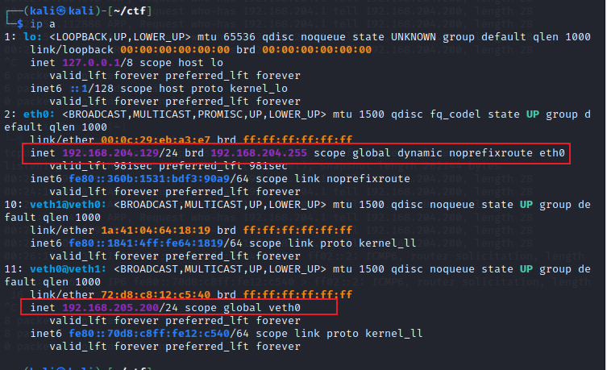
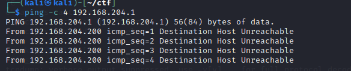
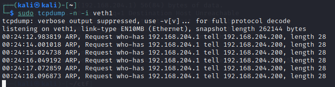

# 基本概念
veth全称是(Virtual Ethernet)虚拟以太网，其原理类似linux管道，在一个veth设备写入网络包，其对端的veth设备可以读取到对应的网络包。
其特点如下：
1、veth和其它的网络设备都一样，一端连接的是内核协议栈。
2、veth设备是成对出现的，另一端两个设备彼此相连
3、一个设备收到协议栈的数据发送请求后，会将数据发送到另一个设备上去。
当建立一个veth设备之后，网络结构就变成了这样


# 示例
## 只给一个veth配置IP
使用ip link命令添加veth0和veth1，然后配置veth0的ip，并将两个设备都启动起来
```
sudo ip link add veth0 type veth peer name veth1
sudo ip addr add 192.168.204.200/24 dev veth0
sudo ip link set veth0 up
sudo ip link set veth1 up
```



这时ping一下网关，发现是ping不通的



监听veth0


监听veth1



发现只有arp的请求包，却没有回复包
为什么会这样呢？
了解一下ping做的事情：
1、ping进程构造ICMP echo请求包，并通过socket发给协议栈
2、协议栈根据目的IP地址和系统路由表，知道去192.168.205.1的数据包应该要由192.168.205.200口出去
3、因为是第一次访问192.168.205.1，并且目的地址和本地ip在同一个网段，所以协议栈会先发送arp请求，询问205.1的mac地址
4、协议栈将arp包交给veth0，让它发出去
5、由于veth0的另一端连的是veth1，所以arp请求包就转发给了veth1
6、veth1收到arp包之后，转交给另一端的协议栈
7、协议栈查看自己的设备列表，发现本地没有192.168.205.1这个ip，于是就丢弃了该请求的arp包。
## 给两个veth设备都配置上ip
给veth1配置上ip地址
```
sudo ip addr add 192.168.205.1/24 dev veth1
```


可以正常ping通
但是查看veth0，发现由icmp echo的请求包，但是没有相应包。


看一下数据包的流程：
1、ping进程构造ICMP echo请求包，并通过socket发给协议栈
2、由于ping程序指定了走veth0，并且本地arp缓存里面已经有了相关记录，所以不用再发arp出去，协议栈就直接将该数据包交给了veth0
3、由于veth0的另一端连接的是veth1，所以ICMP echo请求包就转发给了veth1
4、veth1收到ICMP echo请求包之后，转交给了另一端的协议栈
5、协议栈一看自己的设备列表，发现本地就有205.1这个ip，于是构造了应答包准备返回
6、协议栈查看路由表，发现回给205.200的数据包应该走lo口，于是将应答包交给lo设备
7、lo接到协议栈的应答包后，啥都没干，转手又把数据包还给了协议栈（相当于协议栈通过发送流程把数据包给lo，然后lo再将数据包交给协议栈的接收流程）
8、协议栈收到应答包后，发现有socket需要该包，于是交给了相应的socket
9、这个socket正好是ping进程创建的socket，于是ping进程收到了应答包
# 参考文章
https://segmentfault.com/a/1190000009251098?utm_source=sf-similar-article
# veth相关命令
1、添加/删除veth设备
```
sudo ip link add veth0 type veth peer name veth1 # 添加
sudo ip link del name veth0 # 删除
```
2、为veth设备添加/删除ip地址
```
sudo ip addr add [ip_addr] dev [veth] # 添加
sudo ip addr del [ip_addr] dev [veth] # 删除
```
3、启动/关闭veth设备
```
sudo ip link set [veth] up # 启动
sudo ip link set [veth] down # 关闭
```